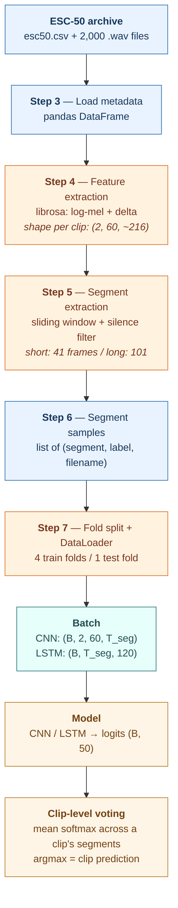
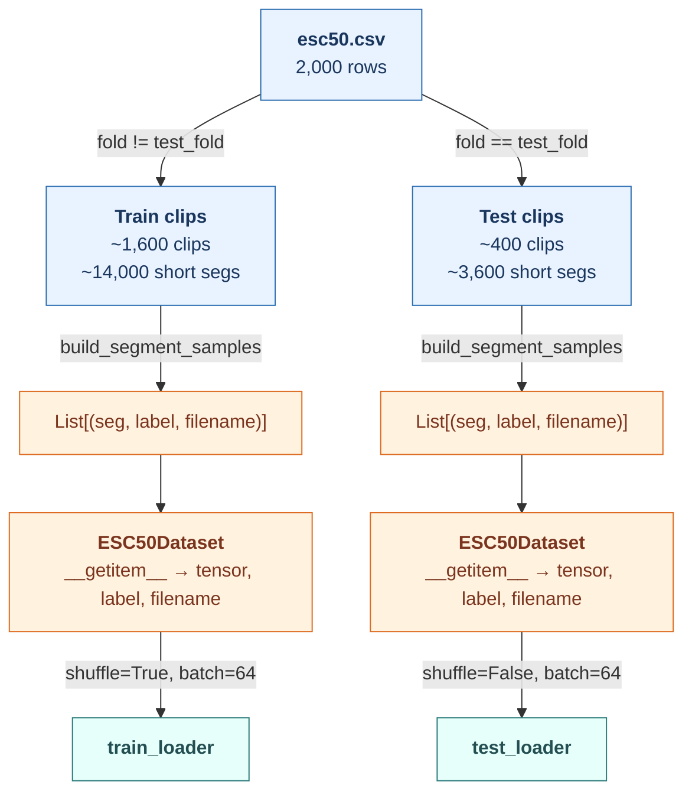

# ESC-50 Data Pipeline — Visual Reference

How raw ESC-50 audio becomes model-ready tensors, shared between the CNN (`Picszak Study Baseline.ipynb`) and LSTM (`LSTM/LSTM baseline.ipynb`, `LSTM/LSTM experiments.ipynb`) notebooks. All steps below correspond to the numbered `# Step N:` cells in those notebooks.

---

## 1. High-level pipeline



---

## 2. Raw dataset organization

### Folder structure (after unzip)

```
piczak_dataset/
├── esc50.csv                 # metadata: one row per clip
└── audio/
    ├── 1-100032-A-0.wav      # naming: {fold}-{id}-{take}-{target}.wav
    ├── 1-100038-A-14.wav
    ├── ...
    └── 5-263902-B-36.wav     # 2,000 files total
```

### Dataset at a glance

| Property | Value |
|---|---|
| Total clips | 2,000 |
| Classes | 50 (balanced: 40 clips/class) |
| Folds | 5 (stratified; 400 clips/fold) |
| Clip duration | 5.0 s |
| Original sample rate | 44,100 Hz (resampled to 22,050 Hz on load) |

### `esc50.csv` schema — columns the code uses

| Column | Type | Used for |
|---|---|---|
| `filename` | str | path to .wav; also the **clip identifier** for clip-level voting |
| `fold` | int (1–5) | train/test split in 5-fold CV |
| `target` | int (0–49) | integer class label |
| `category` | str | human-readable class name (not used in model) |

---

## 3. Audio → features (per clip)

`# Step 4` in every notebook. Runs once per clip, before any fold split.

```mermaid
flowchart LR
    W["<b>WAV file</b><br/>5.0 s, any sample rate"]
      -->|librosa.load<br/>sr=22050| R["<b>Mono waveform</b><br/>y: (110,250,) float32"]
    R -->|librosa.util.normalize| N["<b>Peak-normalised</b><br/>max abs = 1.0"]
    N -->|librosa.feature.melspectrogram<br/>n_fft=1024 hop=512 n_mels=60| M["<b>Mel power</b><br/>(60, T) — T ≈ 216"]
    M -->|librosa.power_to_db| L["<b>Log-mel</b><br/>(60, T) dB"]
    L -->|librosa.feature.delta| D["<b>Delta (1st derivative)</b><br/>(60, T)"]
    L --> S
    D --> S["<b>Stack channels</b><br/>np.stack → (2, 60, T)<br/><i>channel 0: log-mel · channel 1: delta</i>"]

    classDef audio fill:#e8f3ff,stroke:#2b6cb0,color:#1a365d;
    classDef spec fill:#f0fff4,stroke:#2f855a,color:#1c4532;
    classDef out fill:#fef5e7,stroke:#b7791f,color:#744210;
    class W,R,N audio
    class M,L,D spec
    class S out
```



**Why T ≈ 216.** 5.0 s × 22,050 Hz = 110,250 samples. Divided by `hop_length = 512`, plus librosa's default centred padding, yields ≈ 216 frames. Exact count varies ±1 frame across clips.

**Two channels.** `log_mel` captures the spectral envelope; `delta` captures its first-order change over time. Concatenating the two as channels follows Piczak 2015 §3.1 and gives the model access to both static and dynamic cues without needing to learn a temporal filter.

---

## 4. Segment extraction (`# Step 5`)

A single clip produces *many* segments. The two variants differ only in window size and stride:

| Variant | `segment_frames` | `segment_hop_frames` | Overlap | Window duration | Segments per 5-s clip |
|---|---:|---:|---:|---:|---:|
| `short` | **41** | **20** | ~51% | ~0.95 s | ~9 |
| `long` | **101** | **10** | ~90% | ~2.35 s | ~12 |

### Sliding window — schematic

```
Full clip features: (2, 60, 216 frames)   ──────────────────────────────────▶ time
                    │                                                        │
                    ▼                                                        ▼

          ┌─────────────────────────── 216 frames ──────────────────────────┐
          │                                                                 │
 short →  │ [  41  ]         hop 20                                         │
          │        [  41  ]                                                 │
          │               [  41  ]  …                                       │
          │                                          [  41  ]               │
          │                                                 [  41  ]        │
          │                                                        [  41  ] │
          │                                                                 │
 long  →  │ [        101          ]  hop 10                                 │
          │     [        101          ]                                     │
          │          [        101          ]  …                             │
          │                                   [        101          ]       │
          │                                        [        101          ]  │
          └─────────────────────────────────────────────────────────────────┘
              each bracket → one sample of shape (2, 60, segment_frames)
```

### Silence filter

```
for each candidate segment S of shape (2, 60, segment_frames):
    if  mean( |S[0, :, :]| ) > 1e-6:   keep
    else:                              discard     ← pure-silence window
```

The threshold is deliberately loose (log-mel in dB rarely drops to zero), so in practice only zero-padded tail segments get rejected. It is there mainly to prevent a literal-zero input from destabilising training.

---

## 5. Fold split and batching (`# Step 6-7`)

Cross-validation is at the **clip level** — every segment of a given clip stays in the same split, so the test set never contains any segment the model saw during training.



**Why `filename` travels with every segment.** It is the clip identifier used in the **clip-level voting** step. `ESC50Dataset.__getitem__` returns `(tensor, label, filename)` and the evaluation loop groups segment probabilities by `filename` to produce one prediction per clip.

---

## 6. What each model actually sees

Both models receive the *same* segments — only the tensor layout changes.

```
segment on disk:  np.float32  shape (2, 60, T_seg)
                                   │  │    │
                                   │  │    └── T_seg = 41 (short) or 101 (long)
                                   │  └─────── N_MELS = 60
                                   └────────── 2 channels: log-mel, delta
```

### CNN (`Picszak Study Baseline.ipynb` → `PiczakCNN`)

Keeps the native 4-D layout and runs `nn.Conv2d` across (frequency × time).

```
batch  → (B, 2, 60, T_seg)     ── Conv2d(in=2, out=80, kernel=(57,6)) ──▶  ...
```

### LSTM (`LSTM/...` → `LSTMBaseline`)

Reshapes to a sequence so each timestep is a 120-D feature vector `(= 2 channels × 60 mel bins)`:

```python
# From LSTMBaseline.forward
B, C, M, T = x.shape          # (B, 2, 60, T_seg)
x = x.view(B, C * M, T)       # (B, 120, T_seg)
x = x.permute(0, 2, 1)        # (B, T_seg, 120)  ← sequence of 120-D vectors
output, (h_n, _) = self.lstm(x)
```

```
batch  → (B, 2, 60, T_seg)
           │
           ▼  flatten freq × channels
         (B, T_seg, 120)     ── nn.LSTM(input_size=120) ──▶ ...
```

### Side-by-side

| Stage | CNN | LSTM |
|---|---|---|
| Per-batch input | `(B, 2, 60, T_seg)` | `(B, 2, 60, T_seg)` |
| Reshape before model | *(none — `Conv2d` handles 4-D)* | `view → permute` to `(B, T_seg, 120)` |
| Core op | `Conv2d(2→80) → Conv2d(80→80) → FC → FC` | `LSTM(120→hidden) × num_layers → FC` |
| Sequence treated as | 2-D image (freq × time) | 1-D time series (120-D per step) |
| Output logits | `(B, 50)` | `(B, 50)` |

---

## 7. Clip-level voting (output side)

Model outputs are per-segment. The paper-comparable metric (and what `_aggregate_clip_probs` + `_clip_accuracy` compute in both notebooks) is per-clip:


Two metrics are logged every epoch:

| Metric | What it averages over | Paper-comparable? |
|---|---|---|
| `test_acc` | segments | no — segment-level only |
| `clip_test_acc` | clips (via voting above) | **yes** — matches Piczak 2015 numbers |

---

## 8. Key constants (from `# Step 2`)

```python
SAMPLE_RATE = 22050
N_FFT       = 1024
HOP_LENGTH  = 512
N_MELS      = 60
NUM_CLASSES = 50

VARIANT_CONFIGS = {
    'short': {'segment_frames': 41,  'segment_hop_frames': 20},
    'long':  {'segment_frames': 101, 'segment_hop_frames': 10},
}
```

These are fixed — they define the pipeline. Changing any of them invalidates any run name, saved artifact, or reference accuracy tied to the Piczak 2015 baseline.
